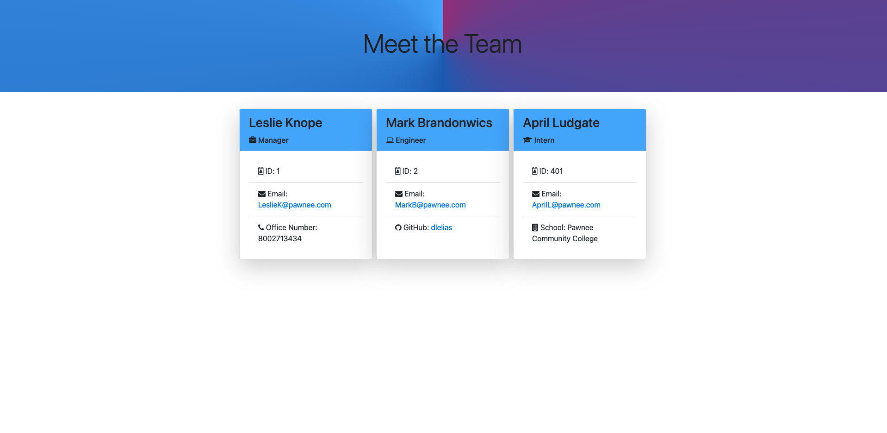

# Team-Profile-Generator
Description

In this project the user is allowed to create employee profiles for Manager, Engineer, and Intern roles by answering a series of questions. 

Each role has a set of questions, such as, email, id, school, or github (depending on the role selected). These inputs are dynamically generated to an HTML file. 

The html page was designed with css, boostrap, and the functionality came from Javascript. 

There are 2 Javascript files  once handles the questions through node (inquire prompt) and the other handles the data to generate to HTML page as well as the styling for index.html.  

There are also a tests for each role. 

url:https://dlelias.github.io/Team-Profile-Generator/

Demo: 

Testing Demo:

Usage:

When the user runs NPM start they will be prompt with manager questions. They will be asked to input manager name, id, email, and office number. Once they are done with these questions they will be asked if they would like to add another member. 

The user will have 3 options after answering the manager questions. The options are engineer, intern or none. 

Should the user select Engineer they will be prompt with questions for the Engineer role. During this set of questions they will be asked to input Engineer's: name, id, email, and github username. Once the user is done with these questions they will be asked if they want to add another member. The options again are Engineer, Intern, or none. 

Should the user select to add an Intern they will be presented with questions for intern. These questions consist of name, id, email, and, school. Once they are done answering these questions they will then be asked if they want to add another member. 

When none is selected a message stating profile has been saved to index.html will be displayed. 

Index.html is located in the dist folder. The user could now see the data appended in a series of cards on the browser. Any email input will have the option for the user to click and send an email. It should be noted every role's email has validation questions during the input phase in index.js

The engineer card will have github username as a hyperlink . When the user selects github user name they will be taken to the github page.

Technologies used:
In this project we used node modules - inquirer and fs .
In this project jest was used to run the manager, employee, intern, and engineer test.
In this project Bootscrape was used for css style. 

License
MIT License

Copyright (c) 2021 Dlelias

Permission is hereby granted, free of charge, to any person obtaining a copy of this software and associated documentation files (the "Software"), to deal in the Software without restriction, including without limitation the rights to use, copy, modify, merge, publish, distribute, sublicense, and/or sell copies of the Software, and to permit persons to whom the Software is furnished to do so, subject to the following conditions:

The above copyright notice and this permission notice shall be included in all copies or substantial portions of the Software.

THE SOFTWARE IS PROVIDED "AS IS", WITHOUT WARRANTY OF ANY KIND, EXPRESS OR IMPLIED, INCLUDING BUT NOT LIMITED TO THE WARRANTIES OF MERCHANTABILITY, FITNESS FOR A PARTICULAR PURPOSE AND NONINFRINGEMENT. IN NO EVENT SHALL THE AUTHORS OR COPYRIGHT HOLDERS BE LIABLE FOR ANY CLAIM, DAMAGES OR OTHER LIABILITY, WHETHER IN AN ACTION OF CONTRACT, TORT OR OTHERWISE, ARISING FROM, OUT OF OR IN CONNECTION WITH THE SOFTWARE OR THE USE OR OTHER DEALINGS IN THE SOFTWARE.
